# Dev News

## Introduction
This assignment includes the development of backend API for a developer news site where users can create articles, comment them and post their reactions (likes, dislikes).


## Getting Started
This application is build with the help of Spring Web and PostgreSQL.
So to make it runnable, you need to first run the database-PostgreSQL. Docker-compose-yaml is already included in the project with all necessary settings.
To run the database, in the root folder, start the docker container using following command.
```bash
docker-compose up
```
Run the following command in the root folder in another terminal after the database has been successfully started.
````bash
gradle bootrun
````

## Usage

### Articles
Article is the core entity in our project. It represents a news article with a unique id, title, body (article text content) and the authorName.
You can find the below mentioned endpoints implementation in src/main/java/se/dev/api/api/ArticleController.java.<br/>
Here are some screenshots of the developed endpoints of Article API.

| HTTP Method    | HTTP Path    | Action        |
| :------------- | :----------: | -----------:  |
| GET            |/articles     | return all articles.|

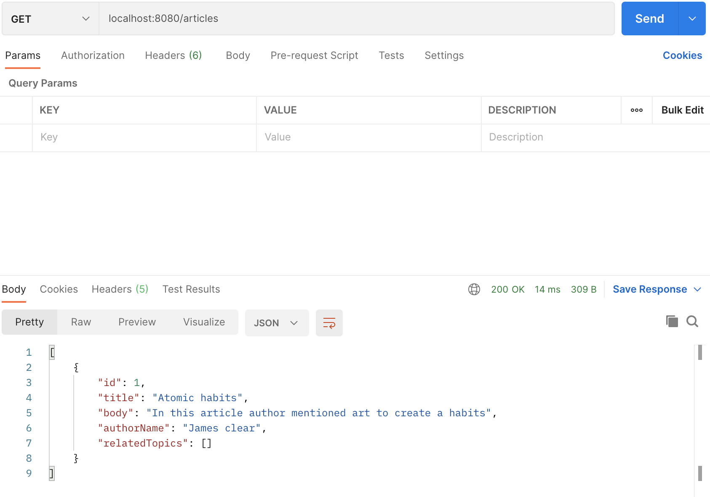

| HTTP Method    | HTTP Path    | Action        |
| :------------- | :----------: | -----------:  |
| GET            |/articles/{id}| return a specific article based on the provided id|

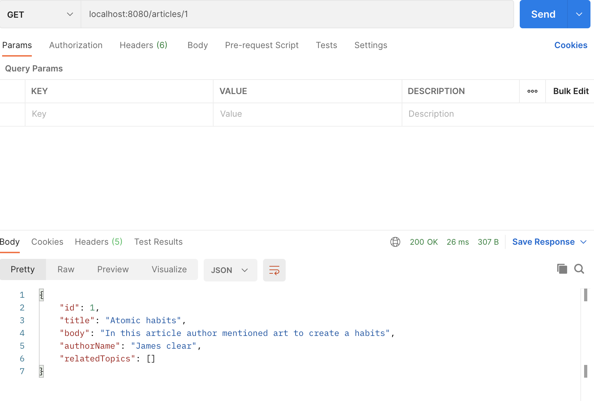

| HTTP Method    | HTTP Path    | Action        |
| :------------- | :----------: | -----------:  |
| POST           |/articles | create a new article.|

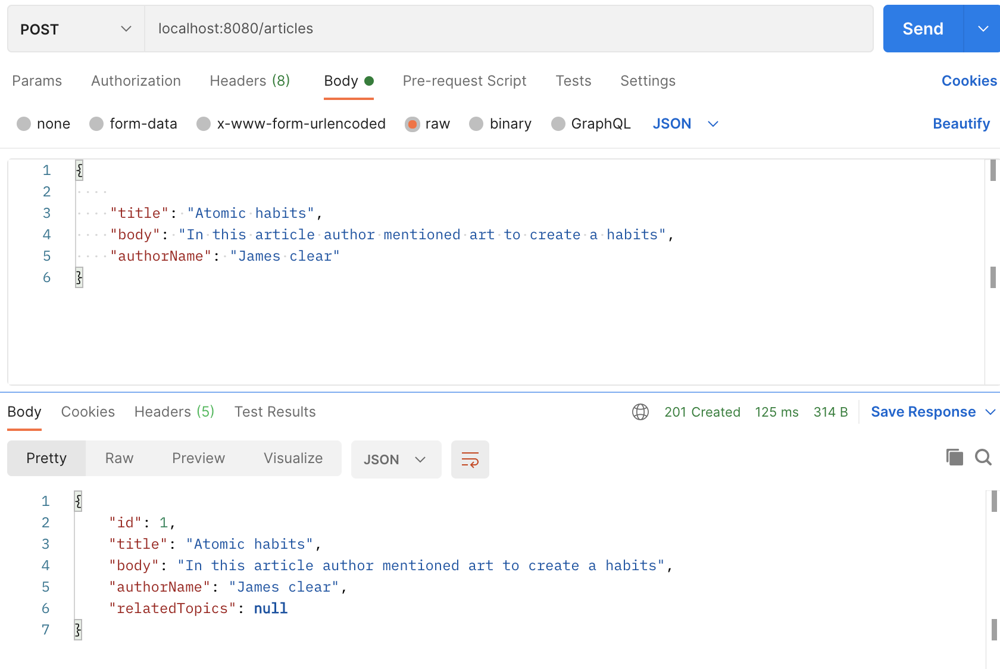
		
| HTTP Method    | HTTP Path    | Action        |
| :------------- | :----------: | -----------:  |
| PUT            |/articles/{id}| update the given article.|

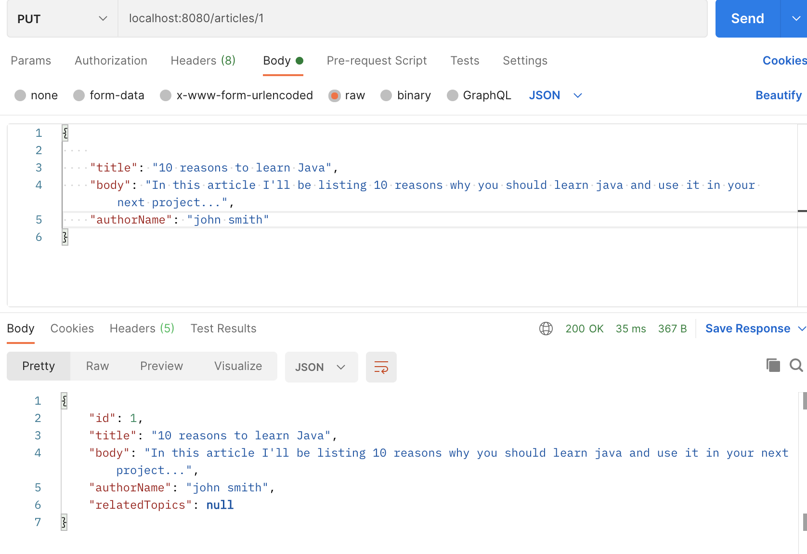

		
| HTTP Method    | HTTP Path    | Action        |
| :------------- | :----------: | -----------:  |
| DELETE        |/articles/{id}| delete the given article.|

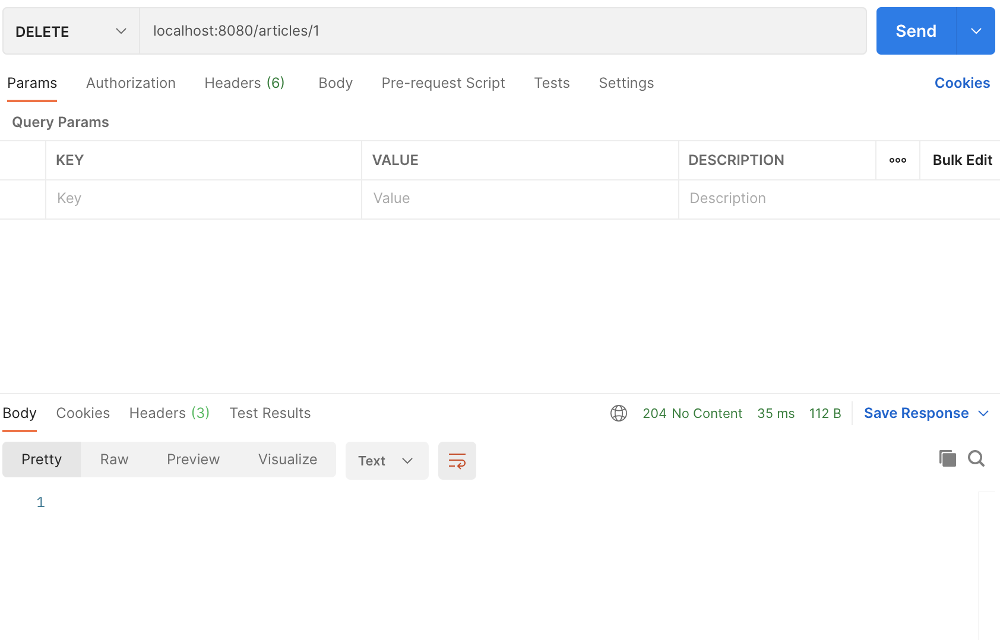

### Comments
We want our visitors to be able to comment the different articles with a unique id, body, authorName (for the comment), and article on which the comment was posted. Each article can have zero or more comments.
You can find the below mentioned endpoints implementation in src/main/java/se/dev/api/api/CommentController.java.<br/>
Here are some screenshots of the developed endpoints of Comment API.

| HTTP Method    | HTTP Path    | Action        |
| :------------- | :----------: | -----------:  |
| GET            |/articles/{articleId}/comments    | return all comments on article given by articleId.|

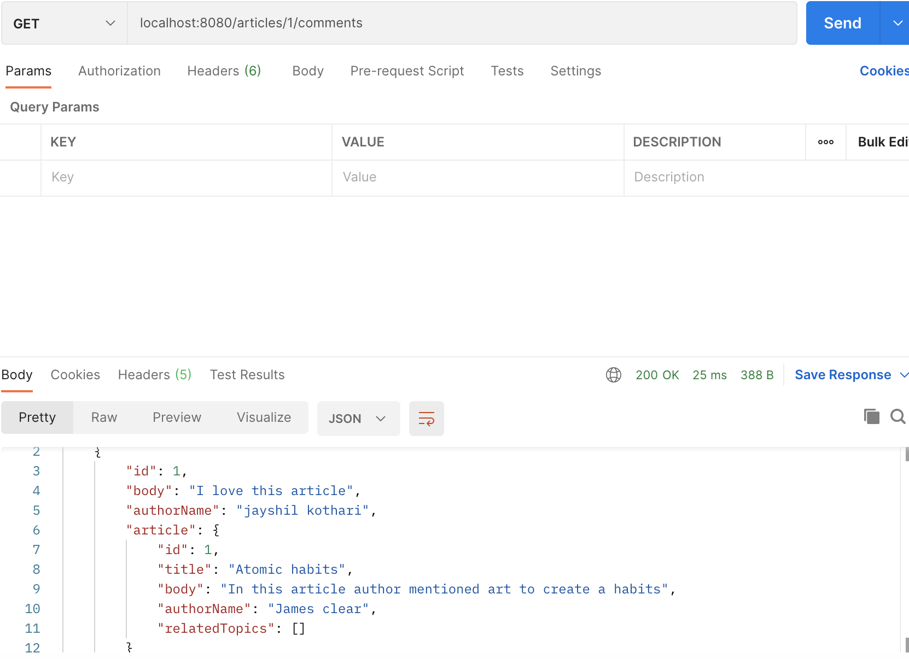

| HTTP Method    | HTTP Path    | Action        |
| :------------- | :----------: | -----------:  |
| GET            |/comments?authorName={authorName}| return all comments made by author given by authorName.|

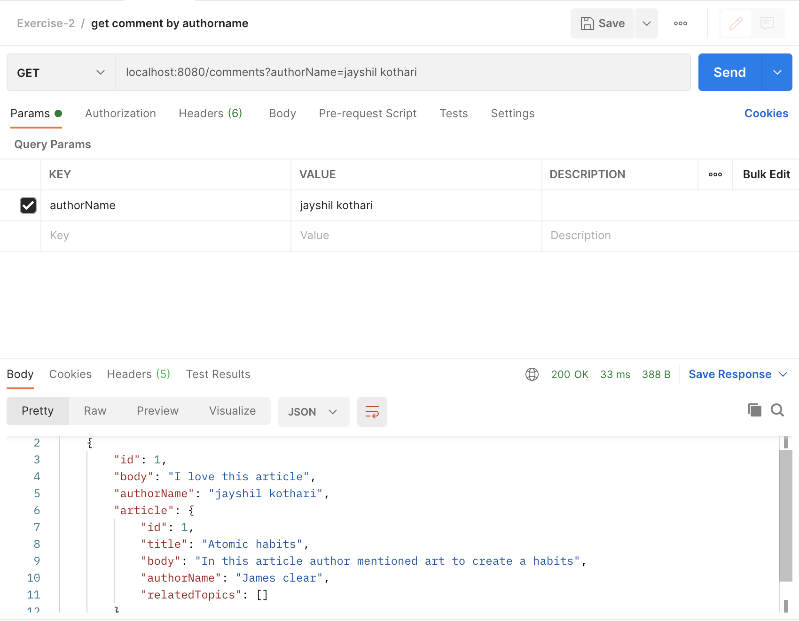

| HTTP Method    | HTTP Path    | Action        |
| :------------- | :----------: | -----------:  |
| POST           |/articles/{articleId}/comments | create a new comment on article given by articleId.|


| HTTP Method    | HTTP Path    | Action        |
| :------------- | :----------: | -----------:  |
| PUT            |/comments/{id}| update the given comment.|

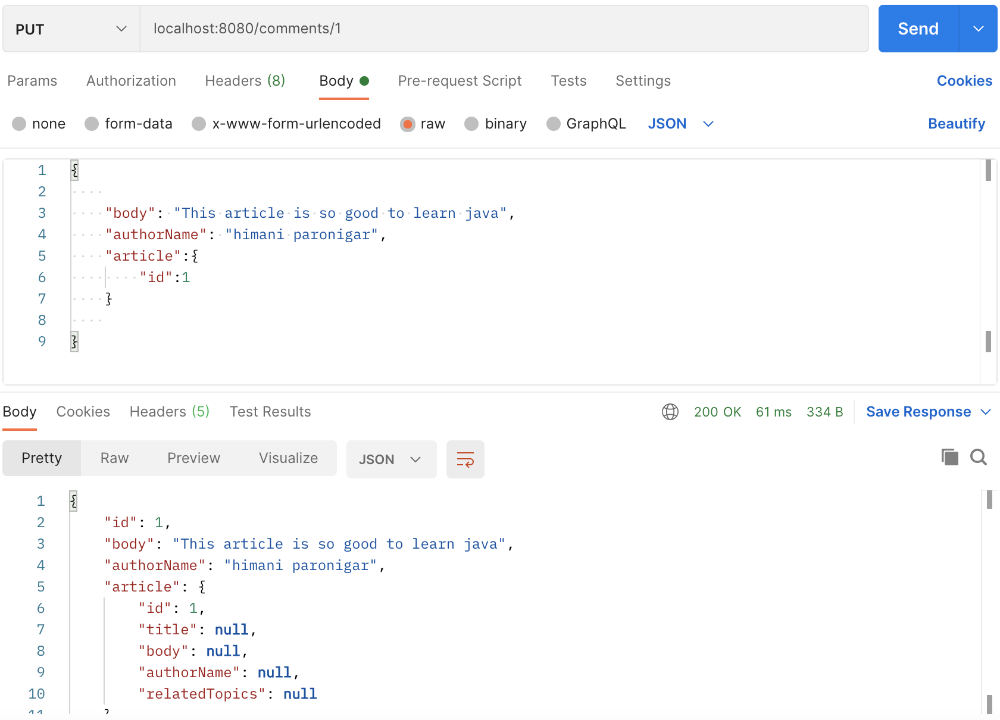


| HTTP Method    | HTTP Path    | Action        |
| :------------- | :----------: | -----------:  |
| DELETE        |/comments/{id}| delete the given comment.|

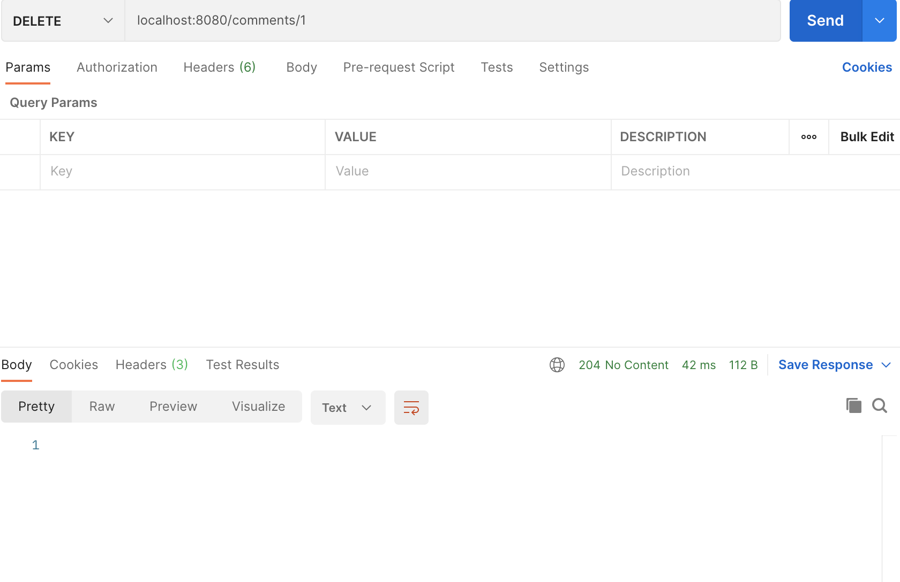

### Topics

We want to categorize our articles by topics. Each topic can be applied to zero or many articles and each article can have zero or many topics.
You can find the below mentioned endpoints implementation in src/main/java/se/dev/api/api/TopicController.java.<br/>
Here are some screenshots of the developed endpoints of Comment API.

| HTTP Method    | HTTP Path    | Action        |
| :------------- | :----------: | -----------:  |
| GET            |	/topics   | 	return all topics.|

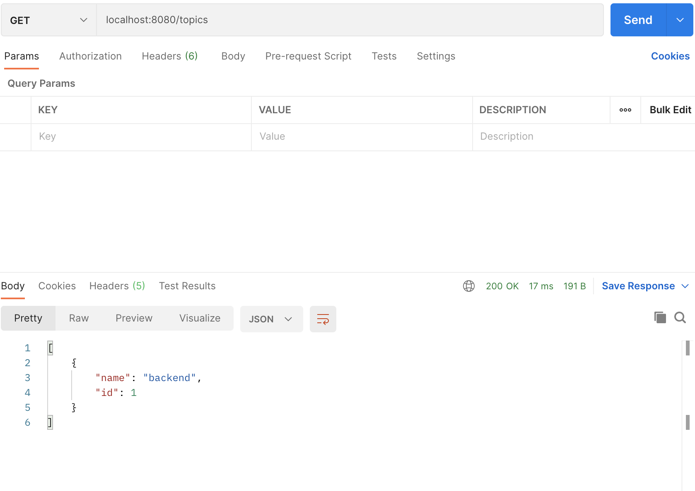

| HTTP Method    | HTTP Path    | Action        |
| :------------- | :----------: | -----------:  |
| GET            |/articles/{articleId}/topics| return all topics associated with article given by articleId.|


| HTTP Method    | HTTP Path    | Action        |
| :------------- | :----------: | -----------:  |
| POST           |/articles/{articleId}/topics | associate the topic with the article given by articleId. If topic does not already exist, it is created.|


| HTTP Method    | HTTP Path    | Action        |
| :------------- | :----------: | -----------:  |
| POST          |/topics| 	create a new topic.|


| HTTP Method    | HTTP Path    | Action        |
| :------------- | :----------: | -----------:  |
| PUT       |/topics/{id}| update the given topic.|

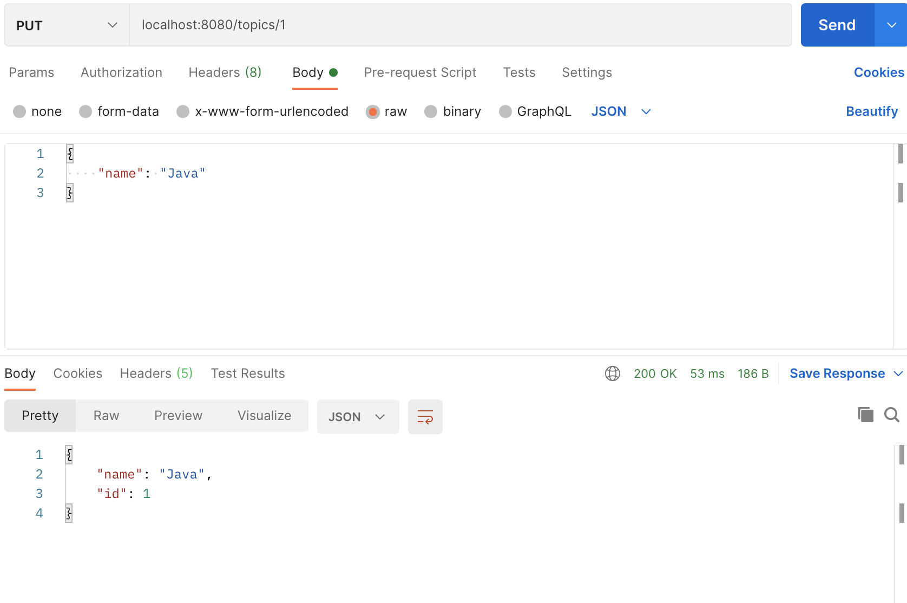

| HTTP Method    | HTTP Path    | Action        |
| :------------- | :----------: | -----------:  |
| DELETE        |/topics/{id}| delete the given topic.|

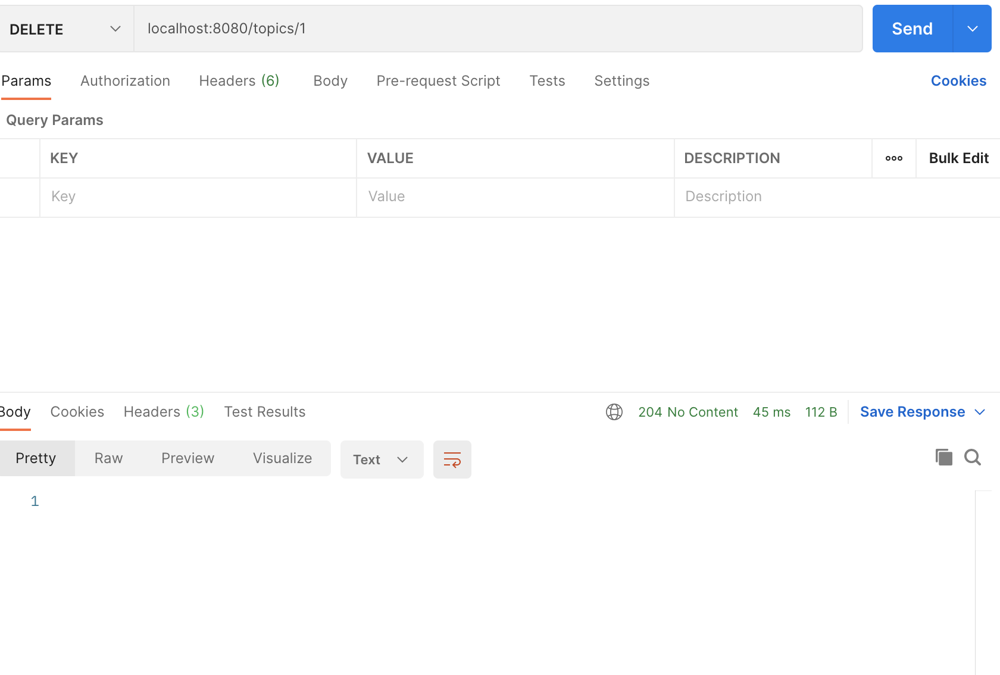

| HTTP Method    | HTTP Path    | Action        |
| :------------- | :----------: | -----------:  |
| DELETE        |/articles/{articleId}/topics/{topicId}| delete the association of a topic for the given article. The topic & article themselves remain.|
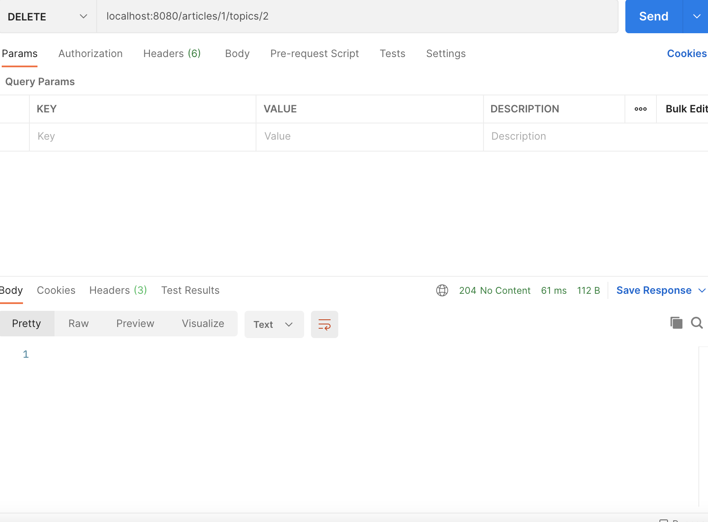

| HTTP Method    | HTTP Path    | Action        |
| :------------- | :----------: | -----------:  |
| GET            |/topics/{topicId}/articles| return all articles associated with the topic given by topicId.|


